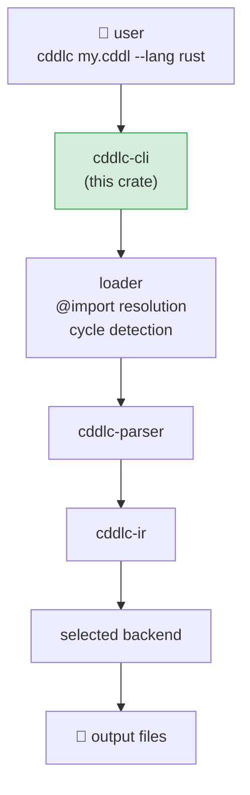
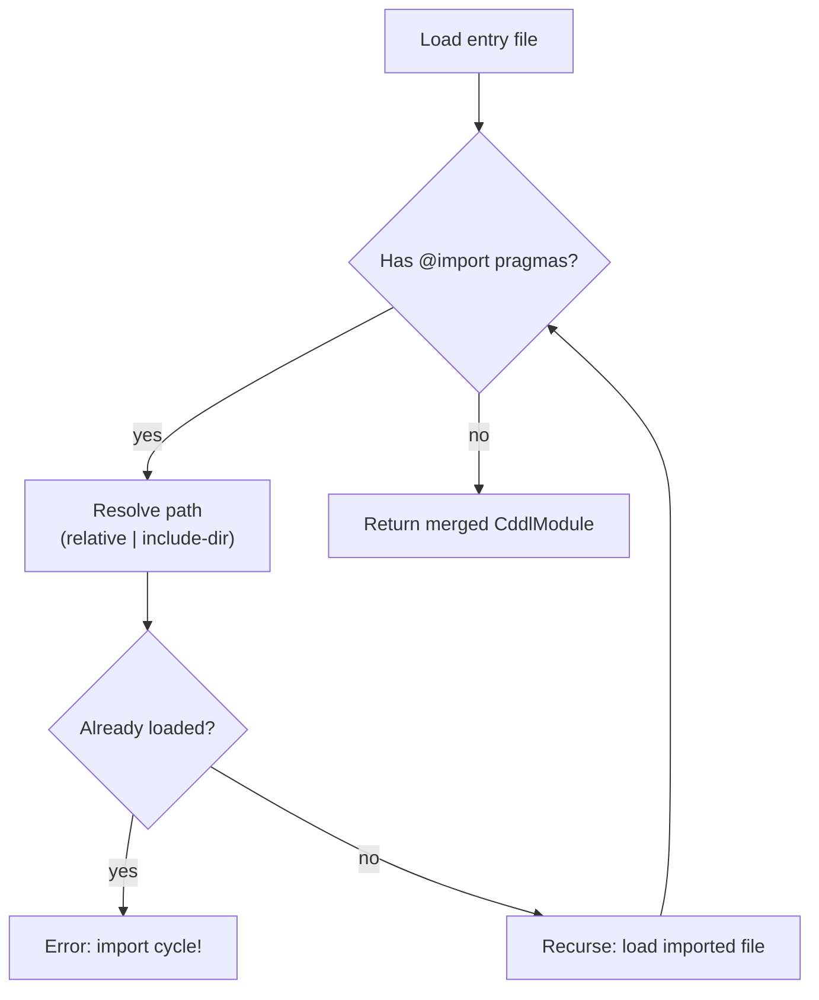

# cddlc-cli

The command-line entry point for `cddlc`.  It parses arguments, resolves `@import` chains,
drives the `cddlc-ir` lowering pass, selects the right backend, and writes all generated
files to disk.

## Position in the pipeline



## Modules

| Module | Responsibility |
|---|---|
| `main.rs` | Argument parsing with [`clap`](https://docs.rs/clap), pipeline orchestration, file writing |
| `args.rs` | Defines `Cli`, `Lang`, `Fmt`, `AllocArg` structs and their `clap` derives; converts CLI enums to codegen enums |
| `loader.rs` | Recursively resolves `@import` pragmas, detects cycles, merges loaded `CddlModule`s |

## `@import` resolution

When the parser extracts a `@import "path"` pragma, `loader.rs` resolves it relative to the
importing file (or relative to any `--include-dir` search path) and parses the target file
recursively.  The loader tracks the set of in-flight paths to detect import cycles and returns
an error immediately if one is found.



Multiple entry-point files on the command line are also supported — each is loaded and their
rule sets merged into a single `CddlModule` before lowering.

## Adding a new language backend

1. Add the backend crate as a dependency in `cddlc-cli/Cargo.toml`.
2. Add a variant to the `Lang` enum in `args.rs` and implement `From<Lang>` for
   `cddlc_codegen::Language`.
3. Add a match arm in `main.rs::run()` that constructs the backend and calls `generate()`.

## Usage

```
cddlc [OPTIONS] <INPUT>...

Arguments:
  <INPUT>...    One or more .cddl source files

Options:
  -l, --lang <LANG>          Target language  [default: rust]
  -o, --output <DIR>         Output directory [default: ./generated]
      --format <FMT>         cbor | json      [default: cbor]
  -r, --runtime <NAME>       CBOR runtime library
      --alloc <STRATEGY>     stack | arena | heap
      --no-std               Rust only: emit #![no_std]
      --dcbor                Deterministic CBOR (RFC 8949 §4.2)
      --depth-limit <N>      Max decoder nesting depth [default: 16]
      --max-array <N>        Default capacity for [* T]  [default: 16]
      --max-str <N>          Default capacity for tstr   [default: 64]
      --namespace <NS>       Symbol namespace prefix
      --include-dir <DIR>    Additional @import search path (repeatable)
      --interop              Generate cross-language interop test vectors
      --interop-langs <LIST> Comma-separated language list for interop
      --dry-run              Analyse only; do not write files
      --debug-parse          Print rich parse diagnostics
  -v, --verbose              Print resolved types and output paths
```

## Environment variables

| Variable | Effect |
|---|---|
| `CDDLC_TRACE=1` | Equivalent to `--debug-parse`; enables detailed winnow trace output |

## Known gaps and future enhancements

- **`--dry-run` machine-readable output**: currently prints a human-readable count of
  resolved types; a `--dry-run --json` option that emits the full IR as JSON would be
  useful for tooling and editors.
- **Watch mode**: no `--watch` flag; regeneration requires re-running the CLI.
- **Schema validation**: there is no mode to validate a CBOR/JSON payload against a CDDL
  schema (as opposed to generating code from a schema).
- **Shell completions**: `clap` can auto-generate completions; they are not currently
  published or installed by the build.
- **Structured CLI errors**: errors are printed as plain strings to stderr; a
  `--output-format json` option for errors would make the CLI easier to wrap in editors.
- **`--interop-langs` default**: Dart is not included in the default interop-langs list
  because `backend-interop` does not yet generate a Dart harness.

## License

MIT OR Apache-2.0
